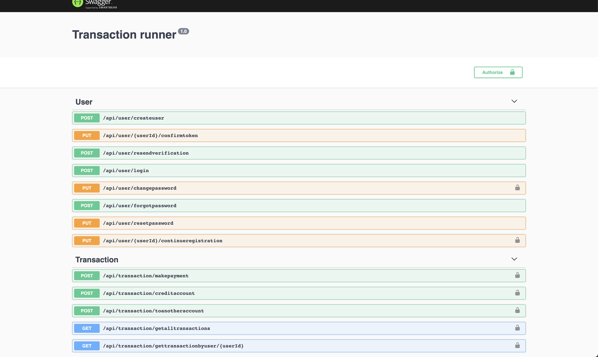

# Transaction Runner

This is an api project developed with nodejs and typescript as the programming language. The database is hosted on a PostgreSQL server. 

## Project setup
- Run `npm install`
- create a .env file on the root directory with the following data. for your gmail mailing service, only use MAIL_USER and MAIL_PASSWORD for mail transport setup, noneed to use the other properties with SMTP* prefix

    - NODE_ENV=DEVELOPMENT_OR_PRODUCTION
    - MAIL_SERVICE=PUT_GMAIL_OR_LEAVE_EMPTY
    - SMTP_HOST=ENTER_HOST_URL_FOR_SMTP
    - SMTP_PORT=ENTER_SMTP_PORT_HERE
    - MAIL_USER=ENTER_YOUR_SMTP_USER_HERE
    - MAIL_PASSWORD=ENTER_A_PASSWORD_TO_YOUR_SMTP
    - TOKEN_SECRET=ENTER_TOKEN_SECRET_HERE
    - USE_MAIL=THIS_VALUE_SHOULD_BE_YES_OR_NO
    - PORT=ENTER_THE_PORT_YOUR_APP_SHOULD_USE
    - DEV_HOST=locahhost
    - PRODUCTION_HOST=ENTER_YOUR_HOST_HERE
- If you do not want to use gmail and you do not have an smtp server use this [example smtp](https://nodemailer.com/about/#example) 
- Run `npm run build`
- Since sequelize works with not only postgresql Setup the database of your choice on the /server/config/config.json file
- **Make sure you first build the project with npm run build**, ensure you have the compiled migration files from /build/server/migrations copied to /server/migrations/compiled folder before running the migration with `npx sequelize db:migrate`. THis in turn runs the migratiion from the files in /server/migrations/compiled.

## Running the project
The APIs are 13 in number, you can see the APIs documented with swagger ui, the link to the api documentation is in `yourdomain/api-docs`. 

### Account creation
The first API to call is /api/user/createuser, on success of the API an instruction would be sent over to your mail, the instructions would help you in setting up a user account on the platform.